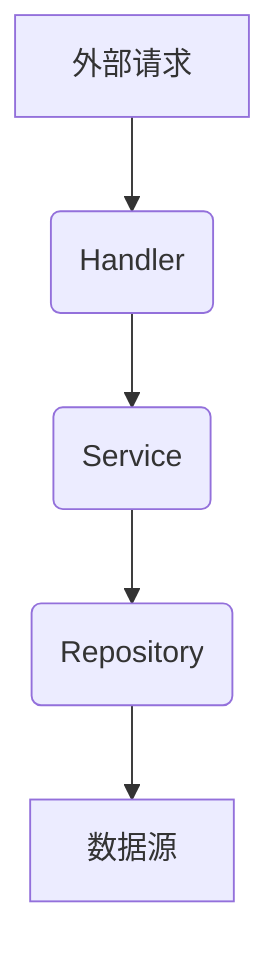

# 项目上下文：app/internal

## 概览

本目录 (`app/internal`) 是 `bs_server` 项目的核心业务逻辑区，遵循严格的分层架构设计，以确保代码的职责分离、可测试性和可维护性。

**禁止** 任何 `internal` 包之外的代码直接导入此目录下的包。

## 核心架构：三层模型

本目录强制执行 `Handler -> Service -> Repository` 的单向数据流和依赖关系。

### 1. Handler 层 (`handler/`)

- **职责**:
    - 接收和解析 HTTP 请求（通过 Gin 框架）。
    - 验证请求参数和 body，并转换为 Service 层需要的 DTO (Data Transfer Object)。
    - 调用 Service 层的方法处理业务。
    - 将 Service 返回的结果或错误，格式化为 HTTP 响应。
- **禁止**:
    - 包含任何实际的业务逻辑。
    - 直接与 Repository 层或数据库交互。

### 2. Service 层 (`service/`)

- **职责**:
    - 实现所有核心业务逻辑。
    - 编排一个或多个 Repository 操作来完成一个业务用例。
    - 处理业务边界条件和复杂逻辑。
    - 是业务规则的唯一权威来源。
- **设计**:
    - Service 必须是无状态的。
    - 所有依赖（如其他 Service 或 Repository）必须通过接口和构造函数注入。

### 3. Repository 层 (`repository/`)

- **职责**:
    - 数据持久化和检索的抽象层。
    - 封装所有与数据库（MongoDB, Redis等）的交互细节。
    - 为 Service 层提供清晰、面向业务的数据访问接口（如 `FindUserByID`, `CreateOrder`）。
- **禁止**:
    - 将底层数据库客户端的特定类型（如 `mongo.Collection`）泄露给 Service 层。
    - 包含业务逻辑。

## 关键约定

- **接口通信**: 所有跨层（Handler-Service, Service-Repository）通信**必须**通过接口（Interface）进行，以实现解耦和依赖倒置。
- **依赖注入 (DI)**: 严格使用构造函数注入。每个结构体（Handler, Service, Repository）都应提供一个 `New...` 函数，用于接收其依赖的接口。
- **错误处理**: 在所有层之间传递错误时，统一使用 `bsvo.AppError` 类型。这确保了从业务逻辑到 HTTP 响应的错误信息传递是标准化的。
- **DTOs (`dto/`)**: 在各层之间传递数据时，使用在 `dto/` 目录中定义的数据传输对象，而不是直接使用数据库模型，以避免层间耦合。
